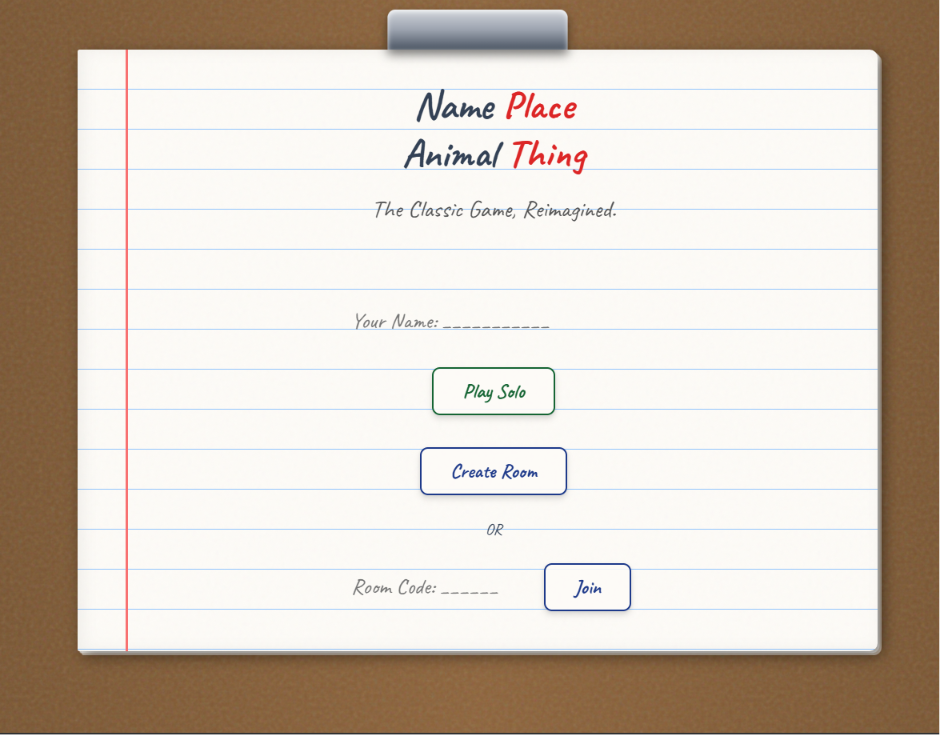
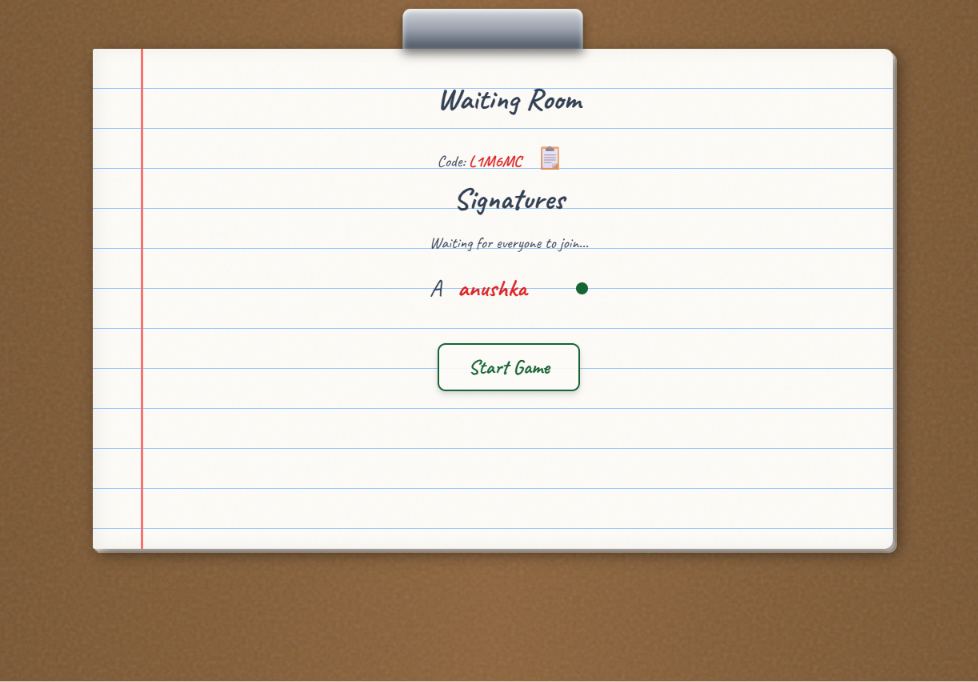
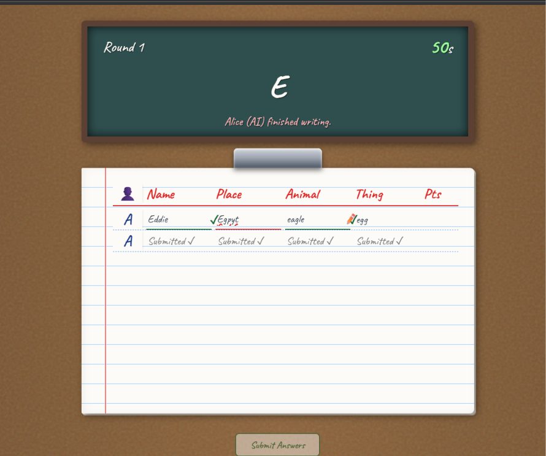
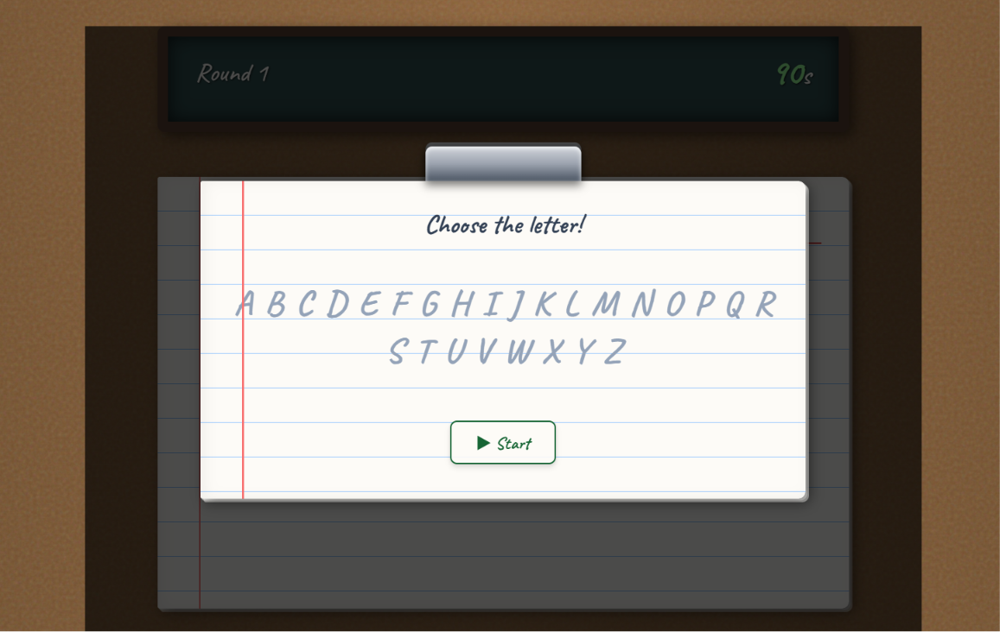
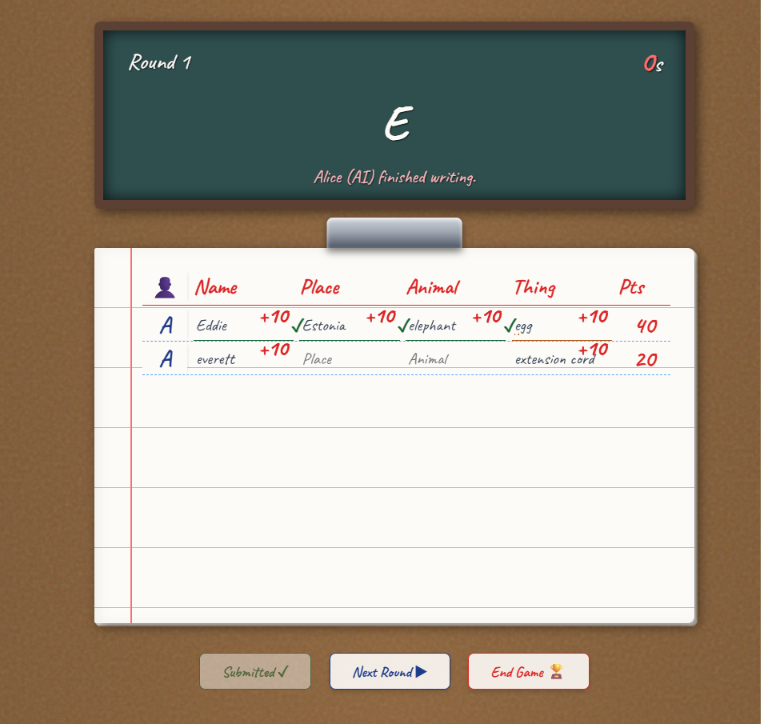

# NPAT Game 🎮

A real-time multiplayer Name, Place, Animal, Thing (NPAT) game built using:

- React + TypeScript
- Vite
- Firebase Authentication
- Firebase Firestore
- Responsive UI

## Features

- Multiplayer rooms
- AI players
- Real-time synchronization
- Automatic scoring
- Mobile responsive design
- Firebase Hosting / Vercel Deployment

## Tech Stack
- React
- TypeScript
- Vite
- Firebase Authentication
- Cloud Firestore
- CSS

## Screenshots

### Home


### Lobby


### Gameplay


### Letter Selection


### Evaluation


### Leaderboard


## Run locally

```bash
npm install
npm run dev
```

## Build

```bash
npm run build
```

## Live Demo
🔗 https://npat-game-fawn.vercel.app

## Source Code
🔗 https://github.com/anushkabhandari47-cpu/npat-game
